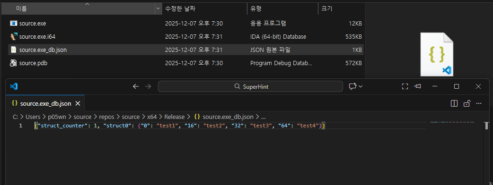

# SuperHint
IDA plugin that allows users to add comments to variable hints

# Installation
Copy `SuperHint.py` to IDA Pro plugins folder

>**Tested version** : IDA pro 8.4

# Usage
Press `Shift`+`A` to enable the feature

Click a variable or struct field in the pseudo-code and press `Shift`+`A` to add a hint comment.

When you close the database, all hint comments added to struct fields are automatically saved to JSON files.

**important**  
Structs are tracked using a magic value stored in their comment field, not by their name.  
This allows the plugin to maintain hints even when struct names change.  
However, if the magic value (e.g., `structX`) is deleted from the struct comment, all associated hints will become inaccessible.

To fix this, simply restore the deleted magic value to the struct comment.
>this issue will be fixed in the future update

# Features
- Supports Local variable and structure fields

# Future updates
- Supporting global variables and functions
